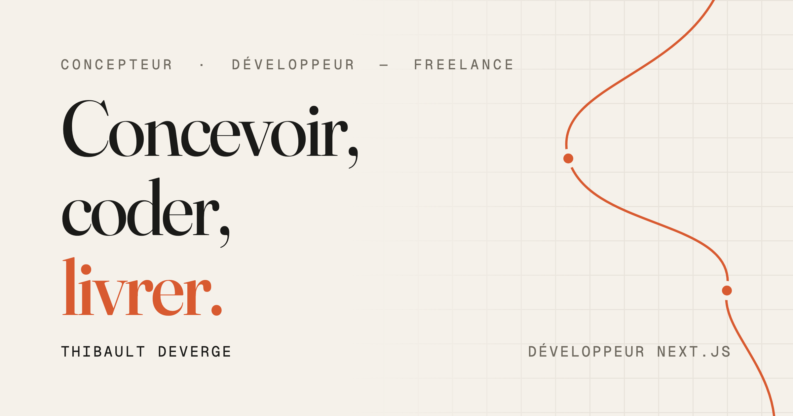

<div align="center">



# Portfolio — Thibault Deverge

**[thibault-deverge.vercel.app](https://thibault-deverge.vercel.app)** · FR / [EN](https://thibault-deverge.vercel.app/en)

One-page « animation-first » : sept scènes chorégraphiées par le scroll,
cousues entre elles par un fil rouge qui se dessine au fil de la lecture.

</div>

---

## Le concept : le fil rouge

Toute la page tient sur une métaphore de couture. Le point du dernier mot du preloader
s'envole et se pose dans le hero — c'est le premier nœud. De là, un trait SVG se coud à
travers les scènes au rythme du scroll, épingle les moments clés (portrait, captures,
kickers), s'allume nœud après nœud, plonge sous la scène sombre et vient se nouer sur la
pastille du contact : *« Le fil s'arrête ici. À vous de le reprendre. »*

Sous le capot ([`components/fil/`](components/fil)) :

- un tracé **Catmull-Rom centripète** (zéro boucle quel que soit l'espacement des ancres)
  passant par des ancres DOM réelles (`data-fil-node`) et des guides invisibles
  (`data-fil-via`) qui routent la courbe dans les gouttières, hors des textes ;
- un dessin au scroll par `stroke-dashoffset`, où la tête du fil suit la ligne de regard
  via une table longueur→position échantillonnée au build (recherche binaire par frame) ;
- des nœuds qui s'allument au franchissement de **seuils exacts en longueur de fil** ;
- rebuild automatique (`ResizeObserver` débouncé), bascules `matchMedia` vivantes,
  version statique complète en `prefers-reduced-motion`.

## Stack

| | |
|---|---|
| Framework | **Next.js 16** (App Router, RSC, SSG) · React 19 · TypeScript strict |
| Styles | **Tailwind CSS v4** (design tokens dans `@theme` — papier, encre, terracotta) |
| Motion | **motion** (`motion/react`) + **Lenis** — un seul système d'animation |
| i18n | **next-intl 4** — FR à la racine, EN préfixé, parité de clés stricte |
| Fonts | Fraunces · Geist · Geist Mono via `next/font` |
| Déploiement | Vercel — 100 % statique (SSG), zéro variable d'environnement |

## Les partis pris

- **Server Components par défaut** : les scènes sont rendues côté serveur ; le motion vit
  dans de petits îlots clients isolés. Le HTML servi est complet et lisible sans JavaScript.
- **Patterns SSR-safe systématiques** : aucun render dépendant de mesures ou de
  `prefers-reduced-motion` ; les états d'animation sont posés post-hydratation ; le
  mouvement continu s'écrit par refs (`style.setProperty`, `stroke-dashoffset`) — les
  composants de scroll ne re-rendent jamais.
- **Une seule animation spectaculaire** (la scène pinnée + le fil) — le reste du motion
  accompagne : reveals sous masque, wipes, micro-interactions 150-300 ms.
- **Perf au niveau paint** : halo du hero en calques composités (zéro repaint au
  mousemove), boucles rAF qui s'endorment à l'arrêt, une écriture de style par frame max.
- **Accessibilité** : navigation clavier complète (`:focus-visible` visible, skip-link),
  `prefers-reduced-motion` = version statique intégrale, alts localisés, hreflang/canonical.

Lighthouse mobile (prod) : **87 · 96 · 100 · 100** — le LCP encaisse volontairement les
~3 s de la cérémonie d'arrivée.

## Développement

```bash
pnpm install
pnpm dev          # http://localhost:3000
pnpm typecheck    # tsc --noEmit
pnpm lint         # eslint
pnpm build        # build de production (SSG /fr + /en)
```

## Architecture

```
app/[locale]/        layout (fonts, i18n, metadata OG/hreflang) · page = les 7 scènes
features/            une feature par scène : hero, about, np-evolution, elloha,
                     manifeste, projets, contact — serveur + îlots clients
components/fil/      le fil rouge : FilRouge (orchestrateur), fil-geometry (spline pure),
                     FilNode / FilVia (les ancres du tracé)
components/motion/   RevealGroup (IO + classes), ScrambleText, Parallax
styles/              un fichier CSS par domaine (theme, hero, reveal, elloha, fil…)
messages/            fr.json / en.json — parité de structure stricte
```

---

<div align="center">

Conçu, codé et livré par **[Thibault Deverge](https://www.linkedin.com/in/thibault-deverge/)** ·
Design et contenus personnels — tous droits réservés.

</div>
